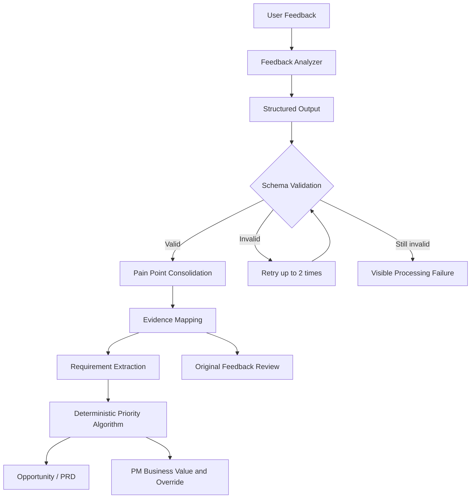

# InsightFlow AI Architecture

Semantic reasoning and deterministic calculation are separated. Every displayed insight retains evidence IDs, while business judgement and final priority remain editable by the PM.

