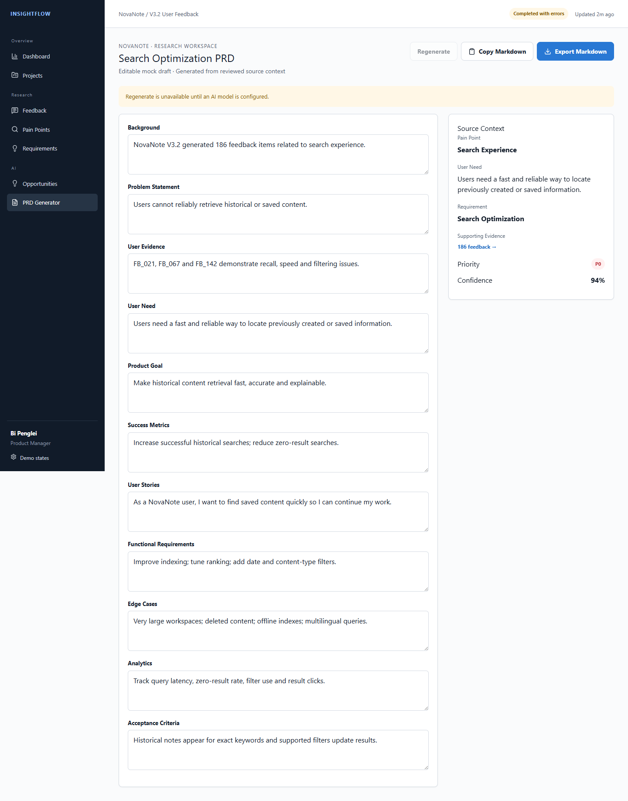

# InsightFlow

## 01 Overview

InsightFlow 是面向产品经理的 AI User Research & Product Insights Agent，将非结构化反馈转换为结构化洞察、可追溯痛点、优先需求和 Evidence-grounded PRD Draft。

| 项目 | 内容 |
| --- | --- |
| Role | AI Product Manager / Product Designer / MVP Developer |
| Scope | 0→1 Product Definition, Figma, MVP, AI Pipeline, Evaluation |
| Type | Portfolio / Case Study Project |
| Deliverables | PRD、Design System、Web MVP、AI Pipeline、Evaluation、Demo |

## 02 Problem

产品经理需要同时处理 App Reviews、Survey Responses、Support Tickets 与 Customer Feedback。数据量大、格式不统一，人工标签和总结容易遗漏重要信号，也很难在需求讨论中快速解释“这个结论来自哪里”。

> The bottleneck is not collecting feedback, but converting it into trustworthy product decisions.

## 03 Target User

Primary User 是负责产品迭代和用户反馈分析的产品经理。核心 JTBD：快速 Understand 用户问题、结合产品策略 Prioritize、将洞察转成可以执行的 Act。

## 04 Product Opportunity

传统路径是 Feedback → Manual Tagging → Spreadsheet → Summary → PM Judgment。InsightFlow 将其重构为 Feedback → Structured AI Analysis → Evidence-backed Insight → Priority Support → PM Decision。机会点不在自动写一份报告，而在建立可信、可验证的决策链路。

## 05 Product Goal

把 1,000 级别反馈从原始文本转换为结构化 Feedback、Pain Point、User Need、Requirement、Priority、Opportunity 和 PRD，同时保持每一步可追溯、可编辑、可见失败。

## 06 Product Strategy

产品定位是 **AI Decision Support**，不是 AI Decision Maker。第一版只验证一条核心闭环，优先处理信任、结构化和决策可控性，而非堆叠集成与自主 Agent。

## 07 User Flow


## 08 MVP Scope

MVP 包含项目创建、CSV/XLSX 上传、字段映射、结构化分析、Pain Point、Evidence、Requirement、Priority 与 PRD Draft。主动砍掉 Jira、Slack/飞书、团队协作、App Store 自动抓取、Vector DB 和复杂 Autonomous Agents，以先验证 Upload → Analyze → Insight → Decision 闭环。

## 09 Design System

视觉采用 1440px Desktop-first 的专业 B2B SaaS 语言：克制色彩、明确层级、紧凑数据密度和可访问状态。避免 ChatGPT Clone、AI Orb、大面积渐变、Glassmorphism 与装饰性 AI 元素。组件与 Token 复用于 Dashboard、表格、Badge、Evidence、Pipeline 和表单。

## 10 Core Experience

### Upload & Mapping

系统真实解析 CSV/XLSX，校验格式、10MB 大小与 5,000 行限制。用户必须确认 Feedback Content，避免在错误字段上启动分析。

### AI Analysis

处理页展示 Data Cleaning、Classification、Sentiment、Pain Point、Requirement 和 Opportunity 等阶段，而不是一个不透明 Spinner；部分失败不会让整个 Batch 失败。

### Evidence-backed Pain Points

Pain Point Detail 同时展示 AI Summary、Severity、Confidence、Breakdown、User Need 和 Supporting Evidence。PM 可以直接核验反馈原文、来源、日期与评分。

### Requirement to PRD

需求详情展示五个评分维度、实时 Priority Score、AI Recommendation 和 Manual Override。PRD Generator 同屏展示 Source Context 与可编辑 Draft。




## 11 AI Architecture

Pipeline 拆成 Feedback Analyzer、Schema Validation、Pain Point Consolidation、Evidence Mapping、Requirement Extraction、Priority Algorithm 与 Opportunity/PRD。模块化处理便于重试、评估和替换 Prompt；实现上不假装存在五个自主 Agent。

## 12 Evidence First

LLM 会产生错误和幻觉，因此所有 Pain Point 必须绑定 `supportingFeedbackIds`。页面允许用户完成 Insight → Evidence → Original Feedback 的逆向验证。没有证据的 Insight 不作为正常高置信结果展示。

## 13 Priority System

```text
Frequency 30% + Severity 25% + User Impact 20%
+ Business Value 15% + Confidence 10%
```

Frequency 与最终 Score 由代码计算；Severity、Impact 和 Confidence 来自结构化语义分析；Business Value 由 PM 控制。系统保留 AI Recommendation 与 PM Final Decision，形成 Hybrid Decision System。

## 14 Human-in-the-loop

**AI Suggests, PM Decides.** AI 不掌握公司战略、预算和组织约束，因此不能替代 Business Judgment、Product Strategy 与 Final Prioritization。产品保留 Evidence Review、Business Value Slider、Manual Override 和 Editable PRD。

## 15 AI Evaluation

评估集包含 100 条合成标注反馈，覆盖 Category、Intent、Sentiment 与 Severity。使用相同 Provider、Zod Schema 和生产 Prompt 比较 V1–V3。

| Metric | V1 | V2 | V3 |
| --- | ---: | ---: | ---: |
| Category Accuracy | 66% | 66% | 70% |
| Intent Accuracy | 13% | 84% | 85% |
| Sentiment Accuracy | 82% | 93% | 95% |
| Severity Exact Accuracy | 73% | 73% | 75% |
| Schema Failure Rate | 0% | 0% | 0% |

V3 综合自动指标最好，被选为当前 Prompt。100 条 AI-assisted proxy review 得到 Pain Point 72.5%、User Need 70.0% 与代理 Hallucination Rate 7%；它不是 Human Evaluation，人工审核仍待完成。

## 16 Prompt Iteration

V1 暴露 Intent 指令边界不足，导致大量语义错配。V2 强化输出词表、字段定义与分类规则，Intent 从 13% 提升到 84%，Sentiment 从 82% 提升到 93%。V3 进一步明确 Category 边界与 Need 提取约束，Category 提升到 70%、Intent 85%、Sentiment 95%、Severity 75%。

## 17 Product Decisions

1. **不做 Autonomous Agent**：Processing Modules 更可控、易重试、易评估、成本更清晰。
2. **LLM 不计算最终 Priority**：数学计算必须 deterministic，避免同输入不同结果。
3. **Evidence First**：让 PM 验证结论，而不是要求其信任黑盒总结。
4. **Demo / Live 双模式**：保证演示可靠，同时控制 API 成本并暴露真实模型状态。

## 18 Results

- 完成可运行的 Upload-to-PRD Web MVP
- 实现 Demo Mode 与 OpenAI-compatible Live AI Pipeline
- 建立 Evidence ID、Schema Validation、Partial Retry 与确定性 Priority
- 完成 100 样本、3 个 Prompt 版本的自动评估
- 建立公开部署、安全扫描、Demo 与 Portfolio 资产

这些是工程与产品交付结果，不代表真实客户采用率或生产效率提升。

## 19 Limitations

- 评估数据集较小，且主要为合成数据
- 没有生产客户数据或长期用户研究
- 人工定性审核与 PRD Review 尚未完成
- Clustering 为 MVP 策略，Confidence 尚未校准
- 没有生产数据库、Durable Queue、Auth 或团队协作
- Live AI 依赖外部 Provider 的成本、速率限制与可用性

## 20 Next Steps

优先完成固定任务走查、Bad Case 复测和可复核证据索引；在条件允许时再扩展真实匿名评估集与人工审核，其次引入 Embedding-based Clustering、Confidence Calibration、生产持久化与可观测性。真人用户验证当前尚未开展，因此不填写采纳率、满意度或效率提升数字。只有核心闭环经过真实用户验证后，再考虑 Feedback Source Integrations 和 Team Collaboration。

## 21 What I Learned

AI 输出质量必须通过评估而非直觉判断；决策支持产品中的可解释性和可追溯性与模型能力同样重要；确定性逻辑应该承担数学计算；Human Override 是弥补 AI 缺少商业上下文的必要机制；0→1 阶段的 Scope Control 比增加更多 AI 功能更重要。
