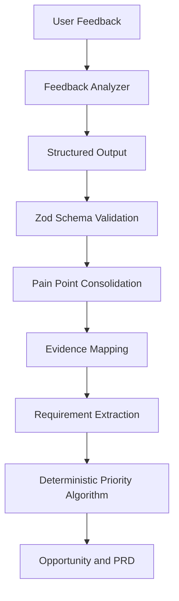

# InsightFlow

> AI User Research & Product Insights Agent

InsightFlow 是一个面向产品经理的 AI 决策支持平台：将 CSV/XLSX 中的非结构化用户反馈转换为可追溯的痛点、用户需求、需求优先级、产品机会和可编辑 PRD 草稿。

**Portfolio / Case Study Project** — 从产品定义、PRD、Figma、MVP、AI Pipeline 到 Evaluation 的端到端实践。

## Problem

产品团队并不缺反馈。真正的瓶颈是：评论、问卷与客服记录数量大、格式不一致，而且人工分类、聚类、统计与总结耗时。InsightFlow 验证的核心假设是：AI 可以缩短整理路径，但任何产品结论都必须能够回到原始证据。

## Product Workflow


主流程：创建项目 → 上传数据 → 字段映射 → AI 分析 → 痛点与 Evidence → 需求优先级 → Product Opportunity → PRD Draft。

## Key Features

- CSV/XLSX 上传、格式/大小/行数校验、字段映射与数据预览
- Feedback 的 Category、Intent、Sentiment、Feature、Severity 与 Confidence 结构化输出
- Evidence-backed Pain Point 与原始反馈追溯
- Requirement Priority、Business Value Slider 与 Manual Override
- 可编辑、复制和导出 Markdown 的 PRD Draft
- Demo Mode、Live AI Mode、Partial Failure、Retry、Low Confidence 与 Insufficient Evidence 状态

## AI Architecture



开发实现采用可控的 AI Processing Modules，而不是不可预测的全自动 Agent。语义判断由模型完成；Schema Validation、Evidence ID 校验与 Priority 计算由代码完成。

## Evidence First

每个 Pain Point 保存 `supportingFeedbackIds`。PM 可以沿着 `Insight → Evidence → Original Feedback` 验证 AI 结论。没有 Evidence 的 Insight 不进入正常展示流程。

## Priority System

```text
Priority Score =
Frequency × 30%
+ Severity × 25%
+ User Impact × 20%
+ Business Value × 15%
+ Confidence × 10%
```

AI 提供 Severity、Impact 与 Confidence 等语义判断，PM 调整 Business Value，系统以确定性代码计算 Score。Manual Override 会保留 AI Recommendation，同时记录 PM 的最终决策：**AI Suggests, PM Decides**。

## Evaluation

使用 100 条合成标注反馈比较 Prompt V1–V3，模型为 `Qwen/Qwen3.5-4B`。V3 被选为当前版本：Category Accuracy 70%、Intent Accuracy 85%、Sentiment Accuracy 95%、Severity Exact Accuracy 75%，Schema Failure Rate 0%。

另有 100 条 **AI-assisted proxy review**：Pain Point 72.5%、User Need 70.0%、代理标记的 Hallucination Rate 7%。这不是 Human Evaluation；原始人工审核表仍为空，PRD 人工审核尚未完成。

## Screenshots


更多演示资料见 [06_Demo](./06_Demo/)；完整产品思考见 [Portfolio Case Study](./07_Portfolio/CASE_STUDY.md)。

## Tech Stack

- Next.js 16 / React 19 / TypeScript
- Tailwind CSS / shadcn/ui conventions / Lucide
- Recharts / React Hook Form / Zod
- Papa Parse / SheetJS
- OpenAI-compatible AI provider
- pnpm / Node.js test runner / Docker

## Local Development

```bash
cd 03_InsightFlow/05_App
pnpm install
cp .env.example .env.local
pnpm dev
```

打开 `http://localhost:3000/dashboard`。没有配置模型时自动进入 Demo Mode。

## Demo Mode and Live AI

Demo Mode 不依赖外部模型，可完整体验核心流程。Live AI 需要在服务端配置：

```text
AI_PROVIDER
AI_API_KEY
AI_BASE_URL
AI_MODEL
```

禁止使用 `NEXT_PUBLIC_` 前缀保存模型密钥。Live AI 会将上传反馈发送给所配置的外部模型服务。

## Verification

```bash
cd 03_InsightFlow/05_App
pnpm test
pnpm typecheck
pnpm lint
pnpm build
pnpm audit:release
```

## Repository Structure

```text
01_Product/    Product Brief, research, PRD
02_Design/     User flow, design system, Figma specs
03_AI/         Pipeline, prompts, schemas, evaluation
04_Data/       Synthetic demo and evaluation datasets
05_App/        Runnable Next.js application
06_Demo/       Screenshots and recording materials
07_Portfolio/  Full and short case studies
```

## Current Limitations

- 作品集项目，尚无生产客户或商业效果数据
- 评估集规模较小，人工定性审核仍待完成
- Clustering 与 Confidence Calibration 仍为 MVP 水平
- 没有正式数据库、用户认证、队列或团队协作
- Live AI 受第三方模型成本、速率限制与可用性影响

## Product Documentation

- [Product Brief](./01_Product/Product_Brief.md)
- [PRD](./01_Product/PRD.md)
- [User Flow](./02_Design/User_Flow.md)
- [Design System](./02_Design/Design_System.md)
- [Agent Design](./03_AI/Agent_Design.md)
- [AI Output Schema](./03_AI/AI_Output_Schema.md)
- [Evaluation](./03_AI/Evaluation.md)

