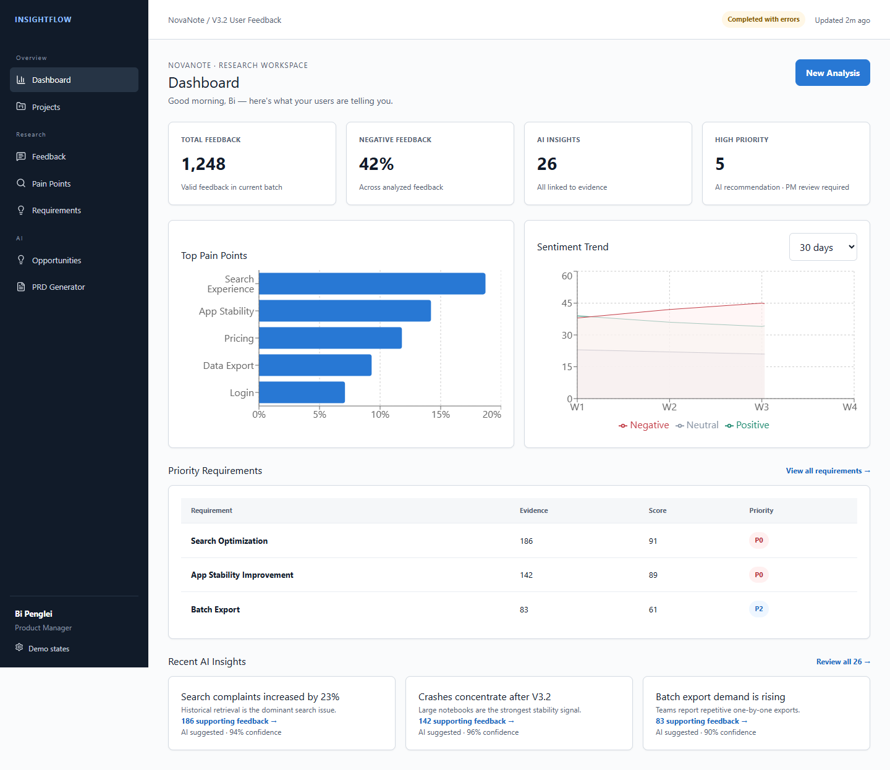

# InsightFlow

> AI User Research & Product Insights Agent

InsightFlow 是一个面向产品经理的 AI 决策支持平台，将 CSV/XLSX 用户反馈转换为结构化洞察、可追溯痛点、需求优先级、产品机会和可编辑 PRD 草稿。



## Live Demo

- CloudBase: https://insightflow-296013-11-1467319446.sh.run.tcloudbase.com
- GitHub: https://github.com/bipenglei-byte/InsightFlow
- Current runtime mode: Demo Mode (the complete mock-data flow is available; server-side Live AI credentials are not configured in CloudBase)

The interactive product interface is fully localized in Simplified Chinese. Real uploaded feedback remains in its original language so Evidence First traceability is preserved.

## Why

产品团队真正的瓶颈不是收集反馈，而是把大量非结构化信息转换为可信的产品决策。InsightFlow 通过 `Upload → Analyze → Understand → Prioritize → Act` 建立端到端闭环。

## Product Principles

- **Evidence First**：每个洞察都能回到原始反馈
- **AI Suggests, PM Decides**：Business Value 与最终优先级由 PM 控制
- **Structured Before Generated**：先结构化事实，再生成总结与 PRD
- **Failure Is Visible**：部分失败、低置信度与证据不足都明确展示

## Architecture


Priority 使用确定性代码计算：Frequency 30% + Severity 25% + User Impact 20% + Business Value 15% + Confidence 10%。

## Evaluation

在 100 条合成标注样本上，Prompt V3 的 Category / Intent / Sentiment / Severity Accuracy 分别为 70% / 85% / 95% / 75%，Schema Failure Rate 为 0%。另有 100 条 **AI-assisted proxy review**；真正的 Human Evaluation 仍待完成。

## Explore

- [Detailed project README](./03_InsightFlow/README.md)
- [Product PRD](./03_InsightFlow/01_Product/PRD.md)
- [AI Design](./03_InsightFlow/03_AI/Agent_Design.md)
- [Demo materials](./03_InsightFlow/06_Demo/)
- [Portfolio Case Study](./03_InsightFlow/07_Portfolio/CASE_STUDY.md)
- [Web application](./03_InsightFlow/05_App/)

## Run Locally

```bash
cd 03_InsightFlow/05_App
pnpm install
cp .env.example .env.local
pnpm dev
```

Without model credentials, the application runs in Demo Mode. Live AI credentials are server-side only. This is a portfolio/case-study project, not a production customer implementation.
